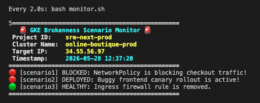

# SRE Testing Suite 🪵

This repository contains the test scenarios used for validating and testing the **`sre-gemini-cli-extension`** ([GitHub Repo](https://github.com/gemini-cli-extensions/sre)).

These scenarios introduce modular chaos into deployments like the Microservices Online Boutique application to test the extension's detection, investigation, and mitigation capabilities.

## Repository Structure

The current layout of the repository is structured as follows:

```
sre-testing-suite/
├── README.md                           # This overview document
├── GEMINI.md                           # Verification guidelines before committing
└── test-scenarios/                     # Test scenarios categorized by platform/app
    └── microservices-demo-gke/         # Breakage scenarios for Online Boutique on GKE
        ├── README.md                   # Overview & prerequisites for GKE testing
        ├── investigation-prompts/      # Test prompts to evaluate the SRE extension
        │   ├── README.md               # Details on using investigation prompts
        │   ├── 00-setup.md             # Initial MCP servers setup instructions
        │   ├── 01-start-investigation.md # Prompts to start investigations
        │   ├── 02-generate-postmortem.md # Prompts to generate incident postmortems
        │   └── 03-generate-graph.md    # Prompts to generate incident graphs
        └── breakage-scnearios/         # Modular chaos scenarios
            ├── README.md               # Detailed scenario guide and manual fixes
            ├── justfile                # Just runner to easily break, fix, and monitor
            ├── monitor.sh              # Real-time brokenness monitor script
            ├── breakage1-checkout/     # Scenario 1: Blackhole traffic to checkout (`just break1`)
            │   ├── break.sh
            │   ├── fix.sh
            │   ├── check.sh
            │   └── test.sh
            ├── breakage2-canary/       # Scenario 2: Buggy frontend canary deployment (`just break2`)
            │   └── ...                 # Same verbs as above
            └── breakage3-firewall/     # Scenario 3: VPC Firewall blocking ingress (`just break3`)
                └── ...                 # ditto
```

## Running Scenarios

Each test scenario is isolated under `test-scenarios/microservices-demo-gke/breakage-scnearios/`. You can navigate to that directory and use the `just` runner to trigger and fix issues:

- **Break Scenario 1 (Cart Checkout Block):** `just break1`
- **Fix Scenario 1:** `just fix1`
- **Break Scenario 2 (Buggy Canary):** `just break2`
- **Fix Scenario 2:** `just fix2`
- **Break Scenario 3 (VPC Firewall Ingress Block):** `just break3`
- **Fix Scenario 3:** `just fix3`

Additionally, you can run the GKE status monitor dashboard to view the current status of all scenarios:
- **Single run:** `just monitor-once`
- **Live dashboard:** `just monitor` (runs under `watch`)

Example: 